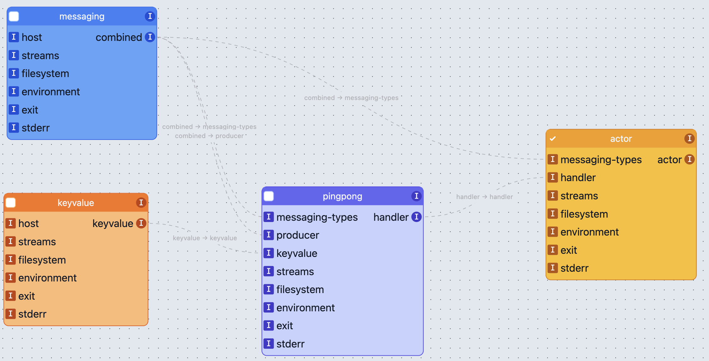

# wasmio 2023

This is the second part of Dan Chiarlone and my demo showing off `wasi-cloud world` WASI APIs.

Checkout the companion demo from [@danbugs](https://github.com/danbugs) at [danbugs/wasmio-demo](https://github.com/danbugs/wasmio-demo).

## What if a component can be run portably across clouds and services?

Let's find out!

*Caveat Emptor:* The tooling around building components and the APIs for wasi-cloud are under active development.
Expect many aspects of this to change and note we needed to add a few workarounds.

### Step 1: Start with a component

We have a component called `pingpong`. This component is built with the latest and greatest
Bytecode Alliance source and is essentially a pure component without any host/framework special sauce.

`pingpong` uses `wasi-messaging` and `wasi-keyvalue` to keep track of the times it was pinged and responds
to pings with pongs and the current ping count.

First we build a preview 1 WASI module, then we migrate this module to preview 2. Note that this
adaption step is temporary until preview 2 stabilizes.

```bash
cd pingpong
cargo build --target wasm32-wasi

# now migrate from WASI preview1 to preview2 (to a wasm component)
wasm-tools component new --output ../deploy/components/pingpong.component.wasm --adapt ../wasi_snapshot_preview1.wasm ../target/wasm32-wasi/debug/pingpong.wasm
```

Let's take a look at the component we created.

```bash
wasm-tools component wit ../deploy/components/pingpong.component.wasm
```

The world file describes the high-level interfaces this component depends on (imports) and the API pingpong exposes `handler`.

```wit
default world pingpong.component {
  import messaging-types: self.messaging-types
  import producer: self.producer
  import keyvalue: self.keyvalue
  import streams: self.streams
  import filesystem: self.filesystem
  import environment: self.environment
  import exit: self.exit
  import stderr: self.stderr
  export handler: self.handler
}
```

## Step 2: Deploy

Let's imagine for a moment that we just pushed the `pingpong` component to a registry and then pulled it down. The output of the wasm-tools command sent the final `.wasm` to `deploy/components` to simulate this.

There a few other components that I've already built in the components folder.
Some of these could be generated dynamically by the host
or built by a pre-processing step and cached.
This burden is on the platform and not on the author of the component.
If you're a dev targeting components, this next step of host
adaption will be opaque to you as a user (Yay!).

If you're a wasm runtime provider like wasmCloud, well then the next trick
is AWESOME because you can easily adapt changes to WASI APIs as well as
iterate independently at the host layer for any WASI builtins.

Open [wasmbuilder.app](https://wasmbuilder.app/)

1. Drag and drop, the `actor`, `messaging`, `keyvalue`, and `pingpong` components
2. Link together imports and exports
3. Check export on the actor
4. Download the component to the `components` directory



```bash
cd ../deploy/components

# Skip this step, we did this visually
# Fuse pingpong with wasmfills to run on wasmCloud
# wasm-tools compose --search-path . --output fused.wasm pingpong.component.wasm --config config.yaml
# There should be warnings about WASI things not being found. That's OK!
# The host will provide these imports at link time.

# Next we need to sign the component
# The signature with claims for capabilities are added to a custom section in the wasm binary
wash claims sign --cap "wasmcloud:keyvalue" --cap "wasmcloud:wasi:messaging" --name pingpong fused.wasm

mkdir -p ../build
cp fused_s.wasm ../build/pingpong_s.wasm
cd ..

# This is the fun part. Launch it!
cosmo launch --launch-only
```

```bash
# Interested in poking around? The following commands are handy.

# Check out the claims with:
wash claims inspect fused_s.wasm

# See all of the tools participating in the producers metadata
# For example: which verison of rust we built with, wit-bindgen, etc
wasm-tools metadata show fused_s.wasm

# This will print a textual version of the binary
wasm-tools parse --wat -o fused.wat fused_s.wasm
```

## Pre-work for infra

If you'd like to replicate this demo to it's fullest, then `cosmo up` a wasmCloud host
in all the places and architectures, e.g. in a different cloud like AWS, GCP, or on a Rasberry PI.

In wasmCloud, we can make runtime changes to use different capabilities including changing the
service, e.g. by changing a link, an app can change from running with Redis to Vault.

First we need to start our providers. I'm going to use a keyvalue provider managed by cosmonic.

Now to make this work end-to-end, we also need a new provider that we can run locally:

```bash
# launch a wasi-messaging enabled provider

# todo --js-domain cosmonic ?
wash ctl start provider --host-id <host-id> <provider-ref>

wash ctl link put <actor-id> <provider-id> "wasmcloud:keyvalue" [values]...
wash ctl link put <actor-id> <provider-id> "wasmcloud:wasi:messaging" [values]...
```
